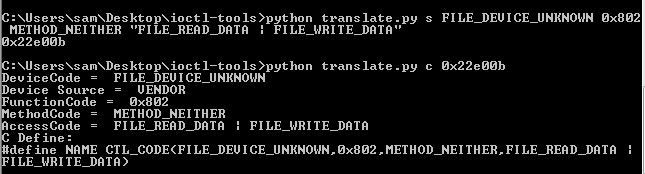
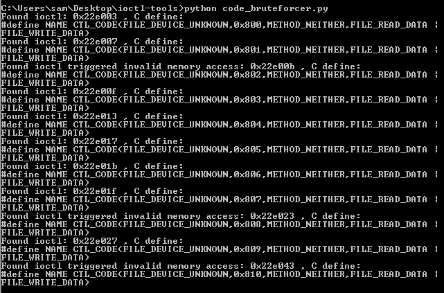

# ioctl-tools
A couple of little tools I've made for working with Windows Drivers

## translate.py
	Translate an ioctl code in hex to its equivalent c define:
		python translate.py (c | code) hex_code
	Example:
		>python translate.py c 0x22e00b
		DeviceCode =  FILE_DEVICE_UNKNOWN
		Device Source =  VENDOR
		FunctionCode =  0x802
		MethodCode =  METHOD_NEITHER
		AccessCode =  FILE_READ_DATA | FILE_WRITE_DATA
		C Define:
		#define NAME CTL_CODE(FILE_DEVICE_UNKNOWN,0x802,METHOD_NEITHER,FILE_READ_DATA | FILE_WRITE_DATA)
	Translate the definition dword values in hex to a hex ioctl code:
		python translate.py (d | dwords) DeviceCode FunctionCode MethodCode AccessCode
	Example:
		>python translate.py d 0x22 0x802 0x3 0x3
		0x22e00b
	Translate the Macro C constants inputs to an ioctl code:
		python translate.py (s | string) DeviceCode FunctionCode MethodCode AccessCode
	Example:
		>python translate.py s FILE_DEVICE_UNKNOWN 0x802 METHOD_NEITHER "FILE_READ_DATA | FILE_WRITE_DATA"
		Outputs: 0x22e00b

## code_bruteforcer.py
	Bruteforces valid ioctl codes and provides definitions for them when setup with valid config to send them to a driver.   
	Correct settings will need to be added as arguments to the CreateFile call.

## basic_fuzzer.py
	Fuzzes a given IOCTL for a given device path by sending random input and output buffers, half the time the sizes passed with buffers will be valid and half the time not.
	Usage: python basic_fuzzer.py DRIVER_PATH_INCLUDING_ESCAPES IOCTL_CODE_IN_HEX
	Logs all sent DeviceIOControls to fuzz.log